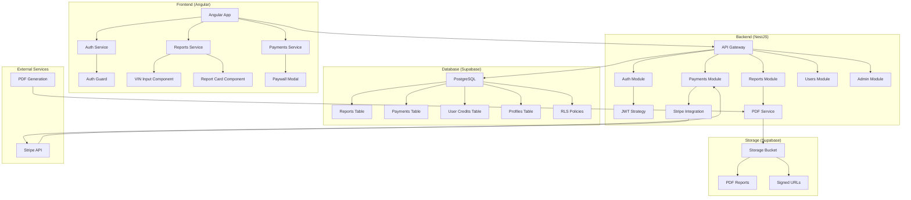
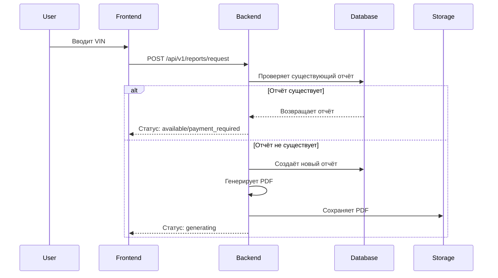
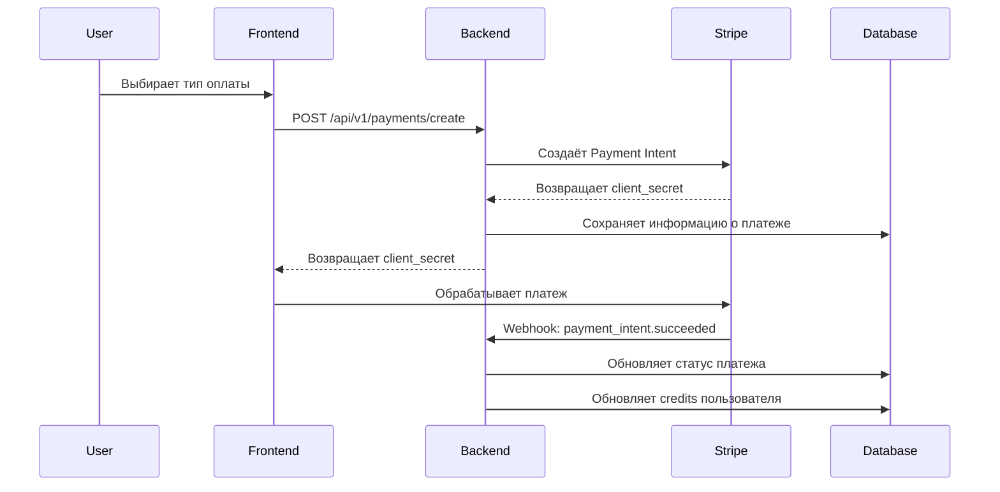
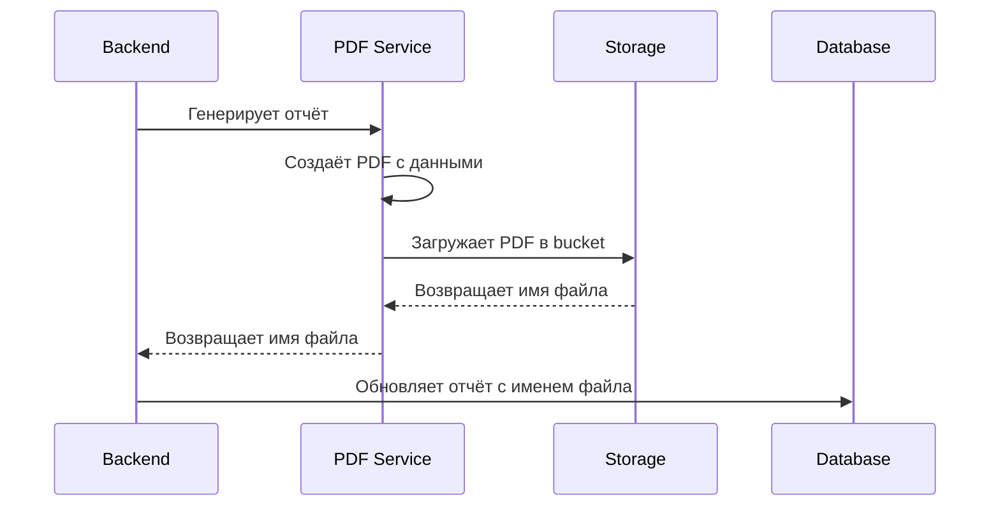

# Архитектура системы CarFax Web

## Обзор системы

CarFax Web - это веб-сервис для получения отчётов по VIN-номерам автомобилей с системой оплаты и управления пользователями.

## Диаграмма архитектуры

## Компоненты системы

### Frontend (Angular)

**Технологии:**
- Angular 17 (LTS)
- TypeScript
- Tailwind CSS
- RxJS

**Основные модули:**
- `AuthModule` - аутентификация и авторизация
- `ReportsModule` - работа с отчётами
- `PaymentsModule` - обработка платежей
- `AdminModule` - административная панель

**Сервисы:**
- `AuthService` - управление пользователями
- `ReportsService` - API для отчётов
- `PaymentsService` - интеграция с Stripe

### Backend (NestJS)

**Технологии:**
- NestJS (Node.js фреймворк)
- TypeScript
- JWT аутентификация
- Swagger документация

**Модули:**
- `AuthModule` - аутентификация (JWT, Supabase Auth)
- `ReportsModule` - управление отчётами
- `PaymentsModule` - обработка платежей (Stripe)
- `UsersModule` - управление пользователями
- `AdminModule` - административные функции
- `PdfModule` - генерация PDF отчётов

**Middleware:**
- Rate limiting (защита от злоупотреблений)
- CORS настройки
- Валидация данных (class-validator)

### База данных (Supabase)

**PostgreSQL таблицы:**
- `reports` - отчёты по VIN
- `payments` - история платежей
- `user_credits` - баланс credits пользователей
- `profiles` - профили пользователей

**Безопасность:**
- Row Level Security (RLS) политики
- JWT токены для аутентификации
- Service role для административных операций

**Storage:**
- Bucket `reports-pdfs` для хранения PDF файлов
- Signed URLs для безопасного доступа

### Внешние сервисы

**Stripe:**
- Обработка платежей
- Webhook для подтверждения оплаты
- Поддержка single и bulk платежей

**PDF Generation:**
- PDFKit для создания PDF отчётов
- Puppeteer для сложной генерации (если нужно)

## Потоки данных

### 1. Запрос отчёта по VIN

### 2. Процесс оплаты

### 3. Генерация PDF

## Безопасность

### Аутентификация
- JWT токены через Supabase Auth
- Refresh token для обновления сессий
- Автоматическое создание профилей при регистрации

### Авторизация
- RLS политики в PostgreSQL
- Guards в Angular для защиты роутов
- Проверка прав доступа на уровне API

### Защита данных
- Валидация всех входных данных
- Rate limiting для предотвращения злоупотреблений
- Шифрование чувствительных данных

## Масштабируемость

### Горизонтальное масштабирование
- Stateless backend (можно запускать несколько инстансов)
- CDN для статических файлов
- Load balancer для распределения нагрузки

### Вертикальное масштабирование
- Оптимизация запросов к базе данных
- Кэширование часто запрашиваемых данных
- Асинхронная обработка PDF генерации

## Мониторинг и логирование

### Логирование
- Структурированные логи в JSON формате
- Различные уровни логирования (error, warn, info, debug)
- Централизованный сбор логов

### Мониторинг
- Health checks для всех сервисов
- Метрики производительности
- Алерты при критических ошибках

## Развёртывание

### Локальная разработка
- Docker Compose для локального окружения
- Hot reload для frontend и backend
- Автоматические миграции базы данных

### Продакшн
- CI/CD pipeline с автоматическим тестированием
- Blue-green deployment для zero-downtime
- Автоматическое масштабирование на основе нагрузки
